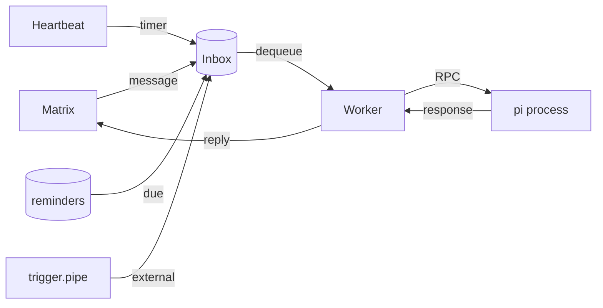

# OpenCrow

A saner alternative to [OpenClaw](https://github.com/openclaw/openclaw).

  

OpenCrow is a Matrix bot that bridges chat messages to
[pi](https://github.com/badlogic/pi-mono), a coding agent with built-in tools,
session persistence, auto-compaction, and multi-provider LLM support. Instead of
reimplementing all of that in Go, OpenCrow spawns pi as a long-lived subprocess
via its RPC protocol and acts as a thin bridge. By default, the bot behaves as
a single shared agent with one session. Setting `OPENCROW_MATRIX_ROOM_ID` gives
triggers and heartbeats a stable default room and enables multi-room invite
handling, while still keeping one shared session across rooms and DMs.

The Go bot receives Matrix messages, forwards them to the pi process, collects
the response, and sends it back.

> [!WARNING]
> There is no whitelisting, permission system, or tool filtering. Trying to bolt
> that onto LLM tool use is inherently futile — the model will find a way around
> it. The only real protection is running OpenCrow in a containerized or sandboxed
> environment. **Use a NixOS container, VM, or similar isolation.** The included
> NixOS module does exactly that. Don't run it on a machine where you'd mind the
> LLM running arbitrary commands.

## Documentation

- **[Tutorial](docs/tutorial.md)** — Step-by-step NixOS deployment with Matrix
- **[Configuration](docs/configuration.md)** — Environment variables, Matrix settings, secrets, and authentication
- **[Skills](docs/skills.md)** — Teaching the agent new capabilities via markdown instructions
- **[Extensions](docs/extensions.md)** — TypeScript lifecycle hooks and custom tools
- **[Heartbeat & Reminders](docs/heartbeat.md)** — Periodic checks, one-shot reminders, trigger pipes
