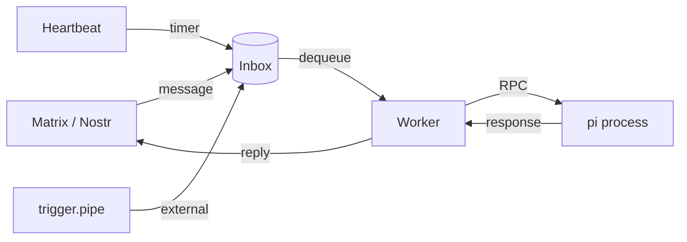

# OpenCrow

A saner alternative to [OpenClaw](https://github.com/openclaw/openclaw).
<p align="center">
  
</p>

OpenCrow is a messaging bot that bridges chat messages to
[pi](https://github.com/badlogic/pi-mono), a coding agent with built-in tools,
session persistence, auto-compaction, and multi-provider LLM support. Instead of
reimplementing all of that in Go, OpenCrow spawns pi as a long-lived subprocess
via its RPC protocol and acts as a thin bridge. The bot operates with a single
active conversation at a time; session data persists across restarts.

OpenCrow supports multiple messaging backends:
- **Matrix** — E2EE chat rooms via mautrix
- **Nostr** — NIP-17 encrypted DMs via go-nostr



The Go bot receives messages from the configured backend, forwards them to the
pi process, collects the response, and sends it back.

> [!WARNING]
> There is no whitelisting, permission system, or tool filtering. Trying to bolt
> that onto LLM tool use is inherently futile — the model will find a way around
> it. The only real protection is running OpenCrow in a containerized or sandboxed
> environment. **Use a NixOS container, VM, or similar isolation.** The included
> NixOS module does exactly that. Don't run it on a machine where you'd mind the
> LLM running arbitrary commands.

## Backend selection

Set `OPENCROW_BACKEND` to choose the messaging backend. Defaults to `matrix`.

| Value | Description |
|---|---|
| `matrix` | Matrix rooms via mautrix (default, backwards compatible) |
| `nostr` | Nostr NIP-17 encrypted DMs |

## Bot commands

Send these as plain text messages in any conversation with the bot:

| Command | Description |
|---|---|
| `!help` | Show available commands |
| `!restart` | Kill the current pi process and start fresh on the next message |
| `!stop` | Abort the currently running agent turn |
| `!compact` | Compact conversation context to reduce token usage |
| `!skills` | List the skills loaded for this bot instance |
| `!verify` | (Matrix only) Set up cross-signing so the bot's device shows as verified |

## General configuration

| Variable | Default | Description |
|---|---|---|
| `OPENCROW_BACKEND` | `matrix` | Messaging backend (`matrix` or `nostr`) |
| `OPENCROW_PI_BINARY` | `pi` | Path to the pi binary |
| `OPENCROW_PI_SESSION_DIR` | `/var/lib/opencrow/sessions` | Session data directory |
| `OPENCROW_PI_PROVIDER` | `anthropic` | LLM provider |
| `OPENCROW_PI_MODEL` | `claude-opus-4-6` | Model name |
| `OPENCROW_PI_WORKING_DIR` | `/var/lib/opencrow` | Working directory for pi |
| `OPENCROW_PI_IDLE_TIMEOUT` | `30m` | Kill pi after this duration of inactivity |
| `OPENCROW_PI_SYSTEM_PROMPT` | built-in | Custom system prompt |
| `OPENCROW_SOUL_FILE` | _(empty)_ | Path to a file containing the system prompt (overrides `OPENCROW_PI_SYSTEM_PROMPT`) |
| `OPENCROW_PI_SKILLS` | _(empty)_ | Comma-separated skill directory paths |
| `OPENCROW_PI_SKILLS_DIR` | _(empty)_ | Directory containing skill subdirectories |
| `OPENCROW_SHOW_TOOL_CALLS` | `false` | Show tool invocations (bash, read, edit, …) as messages in the chat |

## File handling

**Receiving files** — Users can send images, audio, video, and documents to the
bot. Attachments are downloaded to the session directory under `attachments/`
and the file path is passed to pi so it can read or process the file with its
tools. On Nostr, media URLs in DMs are automatically detected and downloaded.

**Sending files back** — Pi can send files to the user by including
`<sendfile>/absolute/path</sendfile>` tags in its response. The bot strips the
tags, uploads each referenced file (to Matrix via MXC, or to a Blossom server
for Nostr), and delivers them as attachments. Multiple `<sendfile>` tags can
appear in a single response.

## Matrix configuration

| Variable | Required | Description |
|---|---|---|
| `OPENCROW_MATRIX_HOMESERVER` | Yes | Matrix homeserver URL |
| `OPENCROW_MATRIX_USER_ID` | Yes | Bot's Matrix user ID |
| `OPENCROW_MATRIX_ACCESS_TOKEN` | Yes | Access token (via environment file) |
| `OPENCROW_MATRIX_DEVICE_ID` | No | Device ID (auto-resolved if omitted) |
| `OPENCROW_MATRIX_PICKLE_KEY` | No | Pickle key for crypto DB |
| `OPENCROW_MATRIX_CRYPTO_DB` | No | Path to crypto SQLite DB |
| `OPENCROW_ALLOWED_USERS` | No | Comma-separated Matrix user IDs allowed to interact |

## Nostr configuration

| Variable | Required | Description |
|---|---|---|
| `OPENCROW_NOSTR_RELAYS` | Yes | Comma-separated relay WebSocket URLs |
| `OPENCROW_NOSTR_PRIVATE_KEY` | Yes* | Hex or nsec private key |
| `OPENCROW_NOSTR_PRIVATE_KEY_FILE` | Yes* | Path to file containing the private key |
| `OPENCROW_NOSTR_BLOSSOM_SERVERS` | No | Comma-separated Blossom server URLs for file uploads |
| `OPENCROW_NOSTR_ALLOWED_USERS` | No | Comma-separated npubs or hex pubkeys |

*Either `OPENCROW_NOSTR_PRIVATE_KEY` or `OPENCROW_NOSTR_PRIVATE_KEY_FILE` is required.

## Secrets and authentication

### Nostr private key

Pass secret files into the container using the `credentialFiles` option. Files
are loaded via systemd-nspawn's `--load-credential` on the host and imported by
the inner service via `ImportCredential`. They are available to opencrow under
`$CREDENTIALS_DIRECTORY/<name>`.

```nix
services.opencrow = {
  credentialFiles = {
    "nostr-private-key" = /path/to/nostr-private-key;
  };
  environment.OPENCROW_NOSTR_PRIVATE_KEY_FILE = "%d/nostr-private-key";
};
```

`%d` is the systemd specifier for `$CREDENTIALS_DIRECTORY` and works in
`Environment=` directives.

### LLM provider credentials

Pi needs credentials for your LLM provider. There are two ways to set this up:

**Option A: API key** — set `ANTHROPIC_API_KEY` (or the equivalent for your
provider) in an environment file and pass it via the `environmentFiles` option.
API keys don't expire and are the simplest approach.

**Option B: OAuth (Claude Pro/Max)** — pi supports OAuth against your Anthropic
account, so you can use your subscription instead of API credits. The initial
login is interactive, but subsequent token refreshes happen automatically
because pi persists the tokens in `PI_CODING_AGENT_DIR`.

The NixOS module provides an `opencrow-pi` wrapper on the host that shells into
the container as the `opencrow` user with the correct environment:

```
sudo opencrow-pi auth login
```

The refresh token persists across restarts — you only need to do this once
(unless the token gets revoked).

### Environment files

For secrets that are plain key=value pairs (e.g. API keys), use
`environmentFiles`. These are bind-mounted read-only into the container and
loaded by systemd's `EnvironmentFile=` directive before the service starts:

```nix
services.opencrow.environmentFiles = [
  /run/secrets/opencrow-env  # contains ANTHROPIC_API_KEY=sk-...
];
```

## Skills

Pi supports skills — markdown files that extend the agent's capabilities by
providing instructions and examples for specific tasks. Each skill is a directory
containing a `SKILL.md` file with a YAML frontmatter (`name`, `description`) and
the skill's instructions.

OpenCrow ships with a `web` skill (for browsing with curl/lynx) and passes it to
pi by default.

### NixOS module

The NixOS module provides a declarative `skills` option — an attrset mapping
skill names to directories:

```nix
services.opencrow.skills = {
  web = "${pkgs.opencrow}/share/opencrow/skills/web";  # included by default
  kagi-search = "${mics-skills}/skills/kagi-search";
  my-custom-skill = ./skills/my-custom-skill;
};
```

All entries are assembled into a single directory via `linkFarm` and passed to
pi through `OPENCROW_PI_SKILLS_DIR`. The attrset is mergeable, so skills can be
added from multiple NixOS module files.

### Environment variables

When not using the NixOS module, configure skills via environment variables:

```
OPENCROW_PI_SKILLS=/path/to/skill1,/path/to/skill2
OPENCROW_PI_SKILLS_DIR=/path/to/skills-directory
```

`OPENCROW_PI_SKILLS` is a comma-separated list of individual skill directories.
`OPENCROW_PI_SKILLS_DIR` points to a directory whose subdirectories are scanned
for `SKILL.md` files. Both can be used together.

### Writing a skill

Create a directory with a `SKILL.md`:

```markdown
---
name: my-skill
description: What this skill does and when to use it
---

Instructions for the agent on how to use this skill...
```

## Heartbeat

OpenCrow can periodically wake up and check `HEARTBEAT.md` in the session
directory, prompting the AI proactively if something needs attention. This is
disabled by default.

Set `OPENCROW_HEARTBEAT_INTERVAL` to a Go duration (e.g. `30m`, `1h`) to enable
it. Every minute the scheduler checks whether the heartbeat interval has elapsed
and reads `<session-dir>/HEARTBEAT.md`. If the file is missing or contains only
empty headers and list items, the heartbeat is skipped (no API call). Otherwise
the file contents are sent to pi with a prompt asking it to follow any tasks
listed there. If pi responds with `HEARTBEAT_OK`, the response is suppressed.
Anything else is delivered to the conversation.

Heartbeat prompts do not reset the idle timer — if no real user messages arrive,
the pi process is still reaped after the idle timeout.

### Trigger pipes

External processes (cron jobs, mail watchers, webhooks) can wake the bot
immediately by writing to the session directory's named pipe (FIFO):

```
<session-dir>/trigger.pipe
```

The `trigger.pipe` is created automatically when the session directory
is set up. A dedicated goroutine reads from the pipe and delivers the content
to pi immediately — no waiting for the heartbeat tick.

Example:

```
echo "New email from alice@example.com" > /var/lib/opencrow/sessions/trigger.pipe
```

Each line written to the pipe is processed as a separate trigger.

> [!CAUTION]
> The trigger pipe is an **unauthenticated** input channel. Any process that can
> write to the FIFO can inject arbitrary prompts into `pi`, which has full tool
> access (shell commands, file I/O, network). This is by design — the pipe is
> meant for trusted local automation (cron, webhooks, mail watchers). The FIFO
> is created with mode `0664`, so any process in the `opencrow` group can write
> to it. Make sure only trusted services are members of that group.

### Configuration

| Variable | Default | Description |
|---|---|---|
| `OPENCROW_HEARTBEAT_INTERVAL` | _(empty, disabled)_ | How often to run heartbeats (Go duration) |
| `OPENCROW_HEARTBEAT_PROMPT` | built-in | Custom prompt sent with the HEARTBEAT.md contents |
